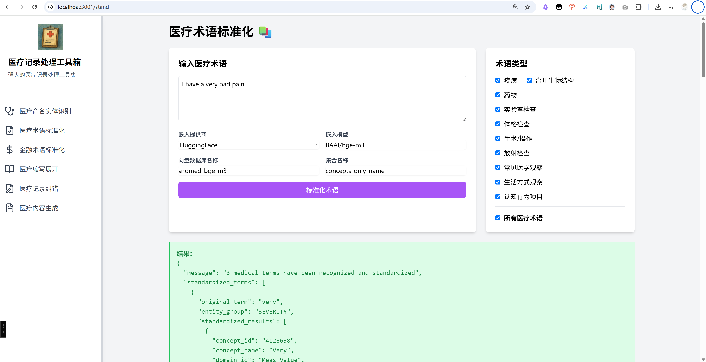
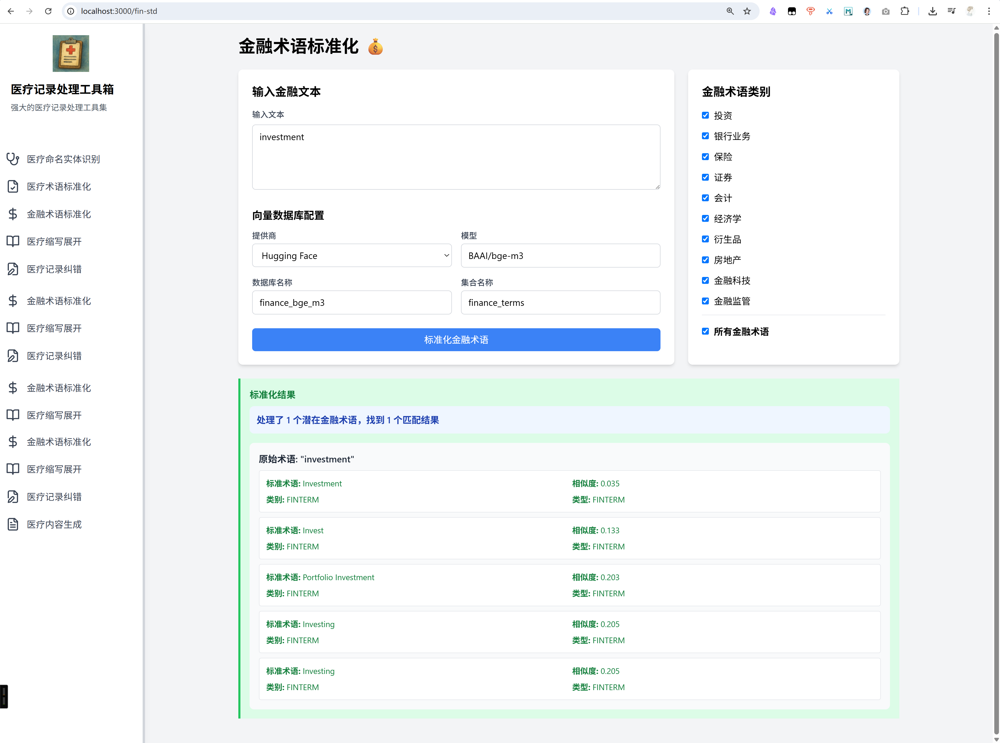

# 医疗术语标准化-运行成功截图



## 金融术语标准化-开发、运行成功截图

```
investment
```


```
宏观经济概览：

2025年第二季度，全球经济延续温和复苏态势，主要经济体在通胀压力缓解与货币政策逐步回归中性的大背景下，市场信心有所回暖。美国劳动力市场韧性仍存，失业率维持在低位，消费支出增长稳定。欧元区经济虽仍承压于地缘政治风险与制造业疲弱，但服务业复苏支撑整体增长。中国经济在政策支持与内需回升的带动下，实现环比温和反弹，房地产、出口、制造业等核心指标呈现边际改善迹象。

在此宏观环境下，全球主要资本市场呈现结构性行情。美股科技板块领涨，得益于AI相关企业盈利超预期；A股则在政策托底与企业基本面改善的共同推动下，市场情绪逐步修复，结构性机会显现，尤其是高端制造与新兴能源领域。
```


后端运行命令
```bash
cd backend
uvicorn main_finance:app --host 0.0.0.0 --port 8000 --reload
```

前端运行命令
```bash
npm start
```